# Transferts — documentation projet

> Document de référence externe — non versionné dans le repo, destiné à
> être partagé hors GitHub (présentations, onboarding, ops).
>
> Pour la doc technique courte et orientée mainteneurs, voir le `README.md`
> à la racine et `docs/S3.md` dans le repo.

## Sommaire

1. [Présentation du projet](#1-présentation-du-projet)
2. [Architecture générale](#2-architecture-générale)
3. [Modèle de données](#3-modèle-de-données)
4. [Cas d'usage utilisateur (captures d'écran)](#4-cas-dusage-utilisateur-captures-décran)
5. [Cycles de vie S3 — diagrammes de séquence](#5-cycles-de-vie-s3--diagrammes-de-séquence)
6. [Cleanup — schémas](#6-cleanup--schémas)
7. [Déploiement et exploitation](#7-déploiement-et-exploitation)
8. [Annexes](#8-annexes)

---

## 1. Présentation du projet

**Transferts** est le service de transfert de fichiers volumineux de
**La Suite territoriale**, l'environnement numérique souverain mis à
disposition des collectivités par l'ANCT. Il vise à remplacer les
solutions WeTransfer / SwissTransfer pour les agents publics dans un
cadre maîtrisé (RGPD, hébergement souverain, journalisation
auditable).

### Promesse produit

- **Simple** : drag-and-drop, lien public ou envoi par courriel,
  expiration paramétrable.
- **Rapide** : upload multipart parallélisé directement vers S3 (pas
  de transit par le backend pour les bytes).
- **Sécurisé** : accès limité par lien à durée de vie, journalisation
  des consultations / téléchargements, désactivation à tout moment.

### Public cible

Agents des collectivités territoriales, authentifiés via
**ProConnect** (OIDC). Les destinataires d'un transfert n'ont pas
besoin de compte.

### Limites configurables

| Paramètre                          | Valeur par défaut |
|------------------------------------|-------------------|
| Taille maximale par fichier        | configurable (`TRANSFER_MAX_FILE_SIZE`) |
| Taille totale d'un transfert       | configurable (`TRANSFER_MAX_TOTAL_SIZE`) |
| Nombre maximum de fichiers / transfert | configurable (`TRANSFER_MAX_FILES_PER_TRANSFER`) |
| Durée de validité (choix discrets) | `TRANSFER_EXPIRY_CHOICES` (settings) |
| Nombre maximum de destinataires    | 50 |

### Intégrations La Suite

- **ProConnect** : authentification OIDC (obligatoire pour créer un
  transfert).
- **Drive** : option d'attacher un fichier directement depuis une
  instance Drive (le fichier est streamé Drive → S3 côté backend, pas
  de référence persistante au Drive après l'import).

---

## 2. Architecture générale

> 📎 Schéma : [`diagrams/architecture.excalidraw`](diagrams/architecture.excalidraw)
> — à importer dans un bloc Excalidraw (la Suite Docs : "+", puis bloc
> *Excalidraw*, puis "Importer" et choisir le fichier).

### Cheminement d'un upload

1. Le navigateur ouvre une session avec le backend (`POST /api/drafts/add-file/`).
2. Le backend ouvre un **multipart upload S3** et renvoie l'`upload_id`.
3. Pour chaque chunk (5 MiB minimum, 16 MiB par défaut côté Drive), le
   navigateur demande une URL signée (`POST /api/drafts/{id}/sign-part/`)
   et fait un `PUT` direct vers S3.
4. À la fin, `POST /api/drafts/{id}/complete-upload/` valide le MPU côté
   S3 et stamp `upload_completed_at`.
5. `POST /api/drafts/{id}/finalize/` promeut le draft en `Transfer`,
   pose les métadonnées (titre, expiration, mode de partage), planifie
   l'envoi des courriels si applicable.

### Topologie réseau (production sur Scalingo)

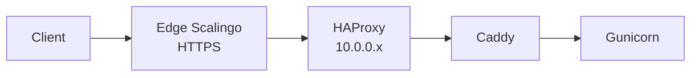

Deux conséquences importantes :

- L'IP réelle du client se trouve en **dernière position** de la chaîne
  `X-Forwarded-For` (l'edge router de Scalingo l'ajoute là). C'est
  cette valeur qui est lue par `XForwardedForMiddleware`.
- Caddy doit **propager** la valeur reçue de Scalingo, **pas**
  l'écraser avec `{remote_host}` (qui serait l'IP du HAProxy interne).

---

## 3. Modèle de données

> 📎 Schéma : [`diagrams/data-model.excalidraw`](diagrams/data-model.excalidraw)
> — à importer dans un bloc Excalidraw.

- Un `TransferDraft` n'a **aucune** métadonnée publique : il ne sert
  qu'à matérialiser l'état "fichiers en cours d'upload".
- À la finalisation, les `TransferFile` sont reparentés en un `UPDATE`
  unique (`draft=NULL, transfer=…`), puis le draft est supprimé.
- Les clés S3 n'embarquent **pas** l'id du parent — uniquement l'id
  du fichier — donc le reparentage ne demande aucun déplacement S3.

---

## 4. Cas d'usage utilisateur (captures d'écran)

> Les captures sont à insérer aux emplacements ci-dessous. Pour les
> regénérer, lancer `make bootstrap` puis `npm run dev` côté frontend
> et naviguer sur `http://localhost:8900` ; les seeds sont disponibles
> via `python manage.py seed_transfers` côté backend.

### 4.1 Page d'accueil (création d'un transfert)

> 

L'utilisateur dépose ses fichiers (ou les sélectionne via le bouton
"Cliquer pour télécharger"), choisit le mode de partage (lien public
ou envoi par courriel), saisit un titre et une durée de validité.

### 4.2 Mode "Lien public"

> 

À la finalisation, un lien `/t/<token>` est généré, copié dans le
presse-papier, et la page de confirmation affiche un récapitulatif
avec la date d'expiration.

### 4.3 Mode "Envoi par courriel"

> 

L'utilisateur saisit jusqu'à 50 adresses. À la finalisation, le
backend déclenche `send_recipient_invitations_task` ; pendant ce temps
le frontend affiche un overlay "Envoi des courriels en cours" qui poll
le champ `notifications_completed_at`.

> 

À la fin, deux issues possibles :

- **Tous les courriels partis** → écran "Transfert envoyé" avec lien
  de partage de secours.
- **Échecs partiels** → écran "Certains courriels n'ont pas pu être
  envoyés" avec invitation à ouvrir le récapitulatif et relancer.

> 
> 

### 4.4 Vue détail d'un transfert (côté propriétaire)

> 

Affiche le statut par destinataire (envoyé / non envoyé / consulté /
téléchargé), permet de **désactiver** le transfert (le lien cesse de
fonctionner et les fichiers sont supprimés), ou de **relancer** les
destinataires en échec (`Resend` ne touche pas à ceux déjà servis).

### 4.5 Page de téléchargement (côté destinataire)

> 

Liste les fichiers, taille, lien "Tout télécharger". Chaque clic
génère un événement d'audit `FILE_DOWNLOADED` côté serveur (sauf si
le destinataire est aussi le propriétaire connecté — pour éviter le
bruit lors de tests).

### 4.6 Sidebar et historique

> 

La sidebar liste les transferts du compte connecté, séparés en
**Actifs** et **Désactivés**, avec recherche, pagination infinie au
scroll, et auto-collapse de la section désactivée si elle est vide.

### 4.7 Mobile

> 

La sidebar passe en drawer (overlay), un bouton burger dans la TopBar
le déclenche. L'état du drawer est transient (pas persisté en
localStorage), le préfèrence de pliage en desktop oui.

---

## 5. Cycles de vie S3 — diagrammes de séquence

Les diagrammes ci-dessous utilisent la syntaxe Mermaid, supportée par
la plupart des éditeurs Markdown récents.

### 5.1 Upload navigateur — chemin nominal

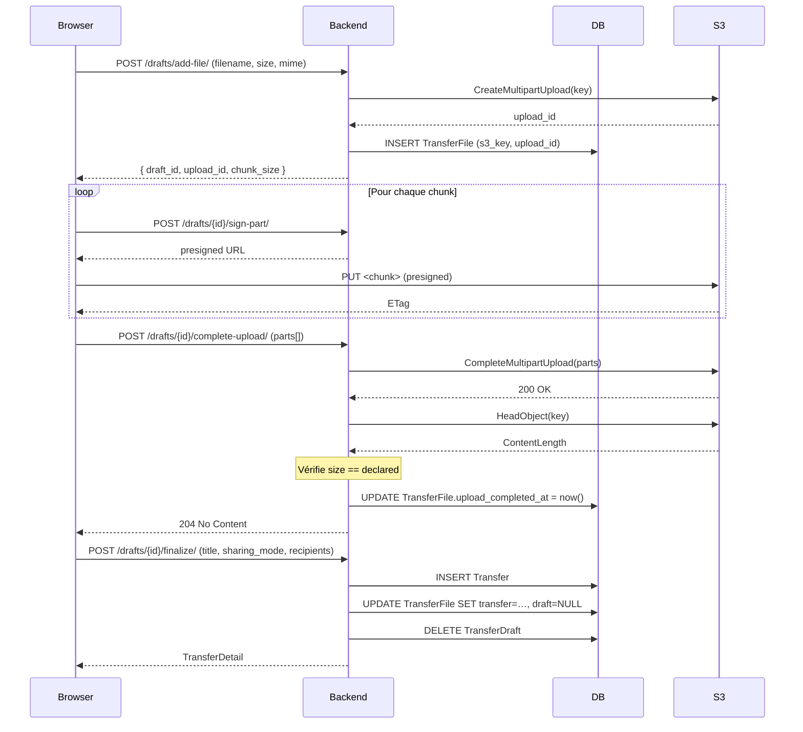

### 5.2 Upload navigateur — `add_file` rollback (DB save échoue)

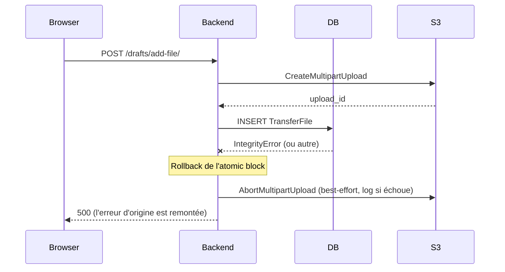

### 5.3 Upload navigateur — `complete_upload` rejeté par S3

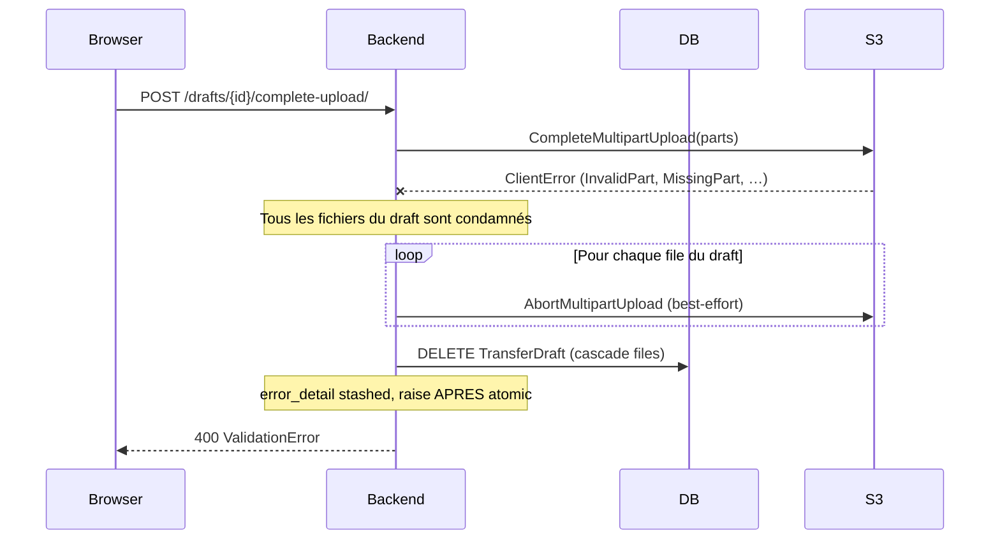

### 5.4 Upload navigateur — incohérence de taille

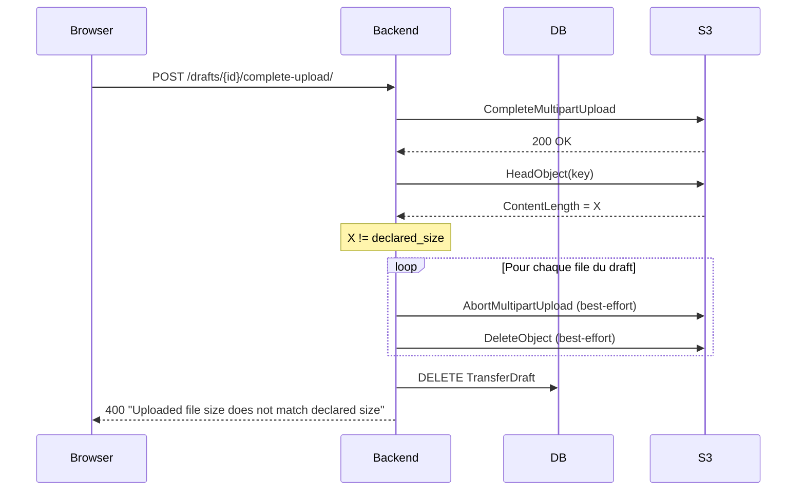

### 5.5 Import Drive — chemin nominal

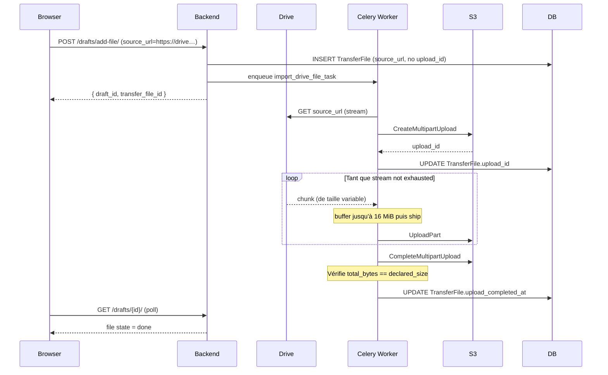

### 5.6 Import Drive — échec mid-stream

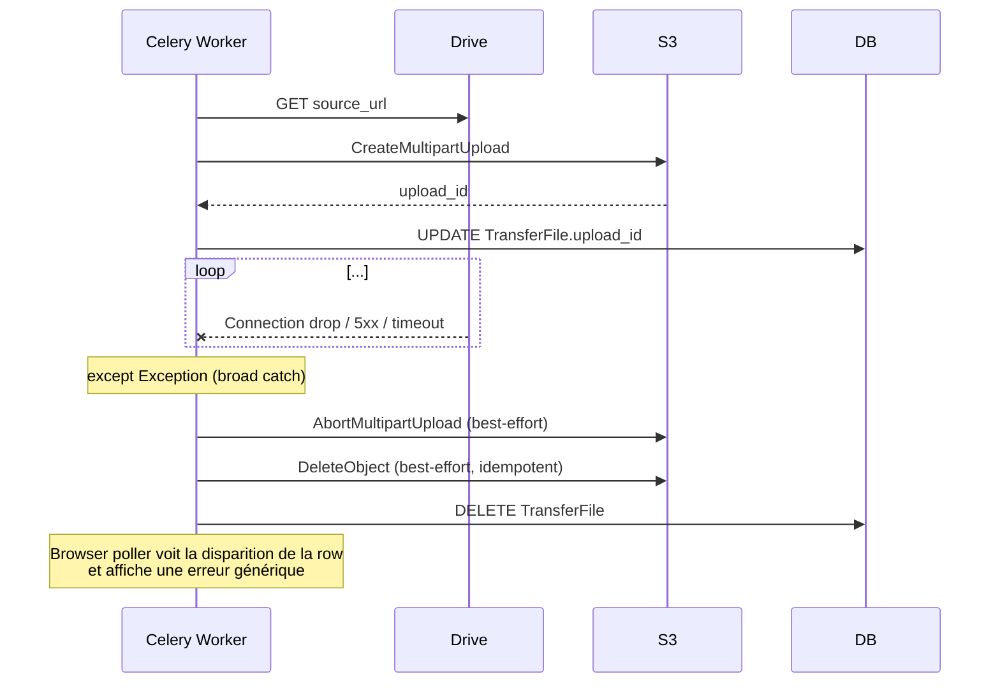

---

## 6. Cleanup — schémas

### 6.1 Décision : qui nettoie quoi ?

```
                            ┌──────────────────────────┐
                            │   Quel est l'événement ?  │
                            └────────────┬─────────────┘
                                         │
       ┌─────────────────────┬───────────┼────────────────────┬────────────────────────┐
       │                     │           │                    │                        │
       ▼                     ▼           ▼                    ▼                        ▼
┌──────────────┐  ┌────────────────┐  ┌────────────┐  ┌──────────────────┐  ┌────────────────────┐
│ User abort   │  │ User remove    │  │ Draft >24h │  │ Transfer expire   │  │ User deactivates   │
│ (draft)      │  │ file from      │  │ jamais     │  │ (cron)            │  │ transfer           │
│              │  │ draft          │  │ finalisé   │  │                   │  │                    │
└──────┬───────┘  └────────┬───────┘  └────┬───────┘  └────────┬─────────┘  └─────────┬──────────┘
       │                   │               │                    │                      │
       │ abort()           │ remove_file() │ cleanup_           │ expire_              │ deactivate()
       │                   │               │ abandoned_         │ transfers_           │
       │                   │               │ drafts_task        │ task                 │
       │                   │               │                    │                      │
       ▼                   ▼               ▼                    ▼                      ▼
   abort MPU + delete object (best-effort) ; DELETE row(s)  ;  delete S3 files only (transfer reste, status flip)

                                    ┌─────────────────────────────────┐
                                    │  + filet de sécurité quotidien :  │
                                    │  sweep_orphan_s3_storage_task     │
                                    │  (--min-age=24h)                   │
                                    └─────────────────────────────────┘
```

### 6.2 Abandon de draft (cron toutes les 6 h, fenêtre 24 h)

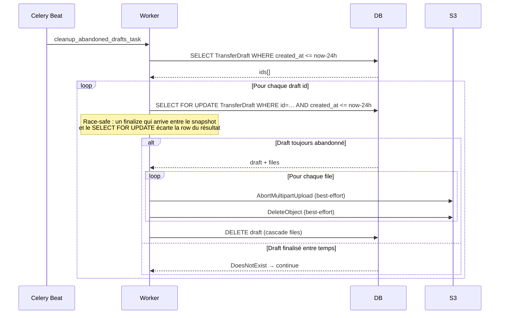

### 6.3 Expiration de transfert

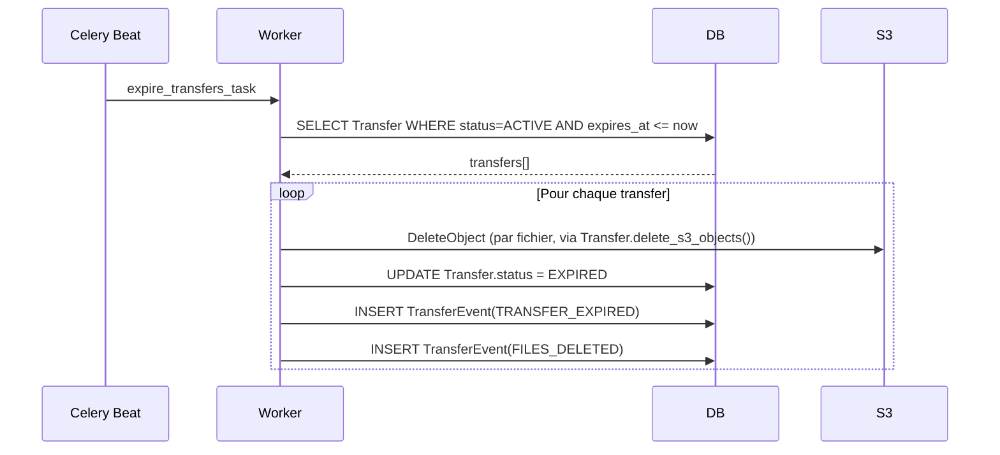

### 6.4 Désactivation manuelle

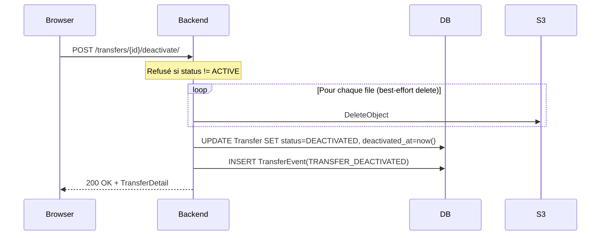

### 6.5 Sweep orphelin quotidien

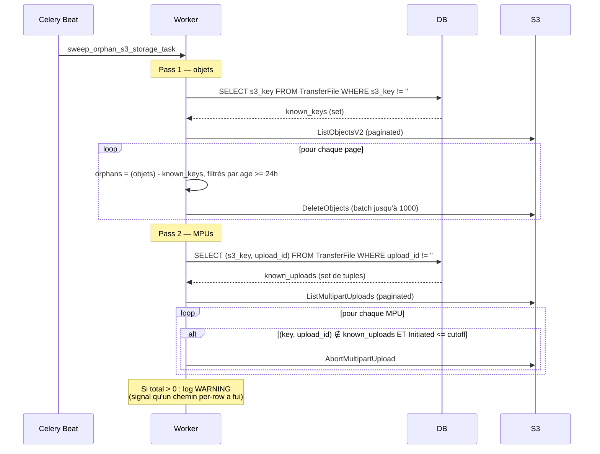

---

## 7. Déploiement et exploitation

### 7.1 Variables d'environnement principales

| Variable | Effet |
|----------|-------|
| `AWS_S3_ENDPOINT_URL`           | URL du bucket S3 vue du backend |
| `AWS_S3_DOMAIN_REPLACE`         | Hostname à utiliser dans les URLs présignées (utile en dev où le backend voit `objectstorage:9000` mais le navigateur `localhost:8906`) |
| `AWS_S3_ACCESS_KEY_ID` / `SECRET_ACCESS_KEY` | Identifiants IAM |
| `AWS_S3_REGION_NAME`            | Région S3 (`us-east-1` par défaut) |
| `AWS_S3_SIGNATURE_VERSION`      | `s3v4` par défaut |
| `TRANSFERS_BUCKET_NAME`         | Nom du bucket |
| `TRANSFER_PRESIGNED_URL_EXPIRY` | Durée de validité des URLs signées (en secondes) |
| `TRANSFER_CHUNK_SIZE`           | Taille de chunk pour upload navigateur |
| `TRANSFER_MAX_FILE_SIZE`        | Taille maximale par fichier |
| `TRANSFER_MAX_TOTAL_SIZE`       | Taille totale maximale d'un transfert |
| `TRANSFER_MAX_FILES_PER_TRANSFER` | Nombre maximum de fichiers |
| `DRIVE_BASE_URL` (+ family)     | Active l'intégration Drive (cf. `README.md`) |

### 7.2 Permissions IAM minimales

```
s3:ListBucket
s3:ListBucketMultipartUploads
s3:GetObject
s3:HeadObject
s3:PutObject
s3:DeleteObject
s3:DeleteObjects
s3:AbortMultipartUpload
s3:ListMultipartUploadParts   (implicite via CompleteMultipartUpload)
```

Sur Scaleway Object Storage, ces permissions s'expriment via une
**bucket policy** ou un utilisateur IAM dédié.

### 7.3 Tâches Celery beat (planning)

Les valeurs sont définies dans `src/backend/transferts/celery_app.py`.

| Tâche | Fréquence | Effet en steady state |
|-------|-----------|------------------------|
| `expire_transfers_task`           | toutes les heures (3600 s) | nettoie les transferts arrivés à terme |
| `cleanup_abandoned_drafts_task`   | toutes les 6 heures (21600 s) | drops les drafts plus vieux que 24 h |
| `sweep_orphan_s3_storage_task`    | quotidienne (86400 s) | doit afficher 0 — non-zéro = signal de fuite |
| `send_recipient_invitations_task` | à la demande (déclenchée par `finalize` ou `resend`) | — |

### 7.4 Signaux à surveiller

- **WARN dans les logs** `orphan-sweep cleaned N object(s) and M MPU(s) — investigate which per-row path leaked` : un chemin par ligne fuit. Inspecter les exceptions remontées dans la même journée.
- **Recipients avec `email_sent_at IS NULL` après `notifications_completed_at`** : les destinataires concernés n'ont pas reçu leur courriel. L'utilisateur peut relancer.
- **Transferts `status=ACTIVE` mais `expires_at <= now()`** depuis plus de 24 h : `expire_transfers_task` ne tourne pas.

### 7.5 Topologie réseau et `X-Forwarded-For`

Cf. [§ 2 / Topologie réseau](#topologie-réseau-production-sur-scalingo)
plus haut. Si l'audit log affiche systématiquement une IP en
`10.0.0.x` (ou `127.0.0.1`), vérifier dans cet ordre :

1. `Caddyfile` : tous les `reverse_proxy` doivent contenir
   `header_up X-Forwarded-For {http.request.header.x-forwarded-for}`.
   **Pas** `{remote_host}`, qui écraserait la chaîne.
2. `XForwardedForMiddleware` : doit lire `[-1]` (rightmost), pas `[0]`.
   La rightmost entry est celle posée par le reverse-proxy de
   confiance et n'est pas spoofable.
3. `USE_X_FORWARDED_FOR` (settings) : doit être à `True` en
   production.

---

## 8. Annexes

### 8.1 Référence rapide des endpoints

Tous les paths sont préfixés par `/api/{API_VERSION}/` (ex.
`/api/v1.0/`). Le préfixe est omis dans la table pour la lisibilité.

| Méthode | Path                                                  | Description |
|---------|-------------------------------------------------------|-------------|
| POST    | `drafts/add-file/`                                    | Ouvrir/alimenter un draft |
| POST    | `drafts/{id}/sign-part/`                              | URL signée pour un chunk |
| POST    | `drafts/{id}/complete-upload/`                        | Clôturer le MPU d'un fichier |
| POST    | `drafts/{id}/remove-file/`                            | Détacher un fichier |
| POST    | `drafts/{id}/abort/`                                  | Tout abandonner |
| POST    | `drafts/{id}/finalize/`                               | Promouvoir en `Transfer` |
| GET     | `drafts/{id}/`                                        | Détail draft (utilisé pour le polling Drive) |
| GET     | `transfers/`                                          | Liste paginée des transferts du compte |
| GET     | `transfers/{id}/`                                     | Détail propriétaire |
| POST    | `transfers/{id}/deactivate/`                          | Désactivation manuelle |
| POST    | `transfers/{id}/resend/`                              | Relance des invitations en échec (mode email) |
| GET     | `transfers/{id}/events/`                              | Audit log d'un transfert |
| GET     | `users/...`                                           | Endpoints utilisateur (profil OIDC) |
| GET     | `downloads/{public_token}/`                           | Vue publique d'un transfert (sans auth) |
| GET     | `downloads/{public_token}/files/{file_id}/download/`  | URL signée pour télécharger un fichier |
| GET     | `config/`                                             | Config runtime frontend |

### 8.2 Pour aller plus loin

- `docs/S3.md` (versionné dans le repo) — détails techniques par
  composant, à lire avant de modifier `core/services/s3*.py` ou
  `core/api/viewsets/draft.py`.
- `README.md` à la racine — setup local (`make bootstrap`) et
  intégration Drive.
- `src/backend/README.md` — arborescence du backend.
- `src/frontend/README.md` — arborescence du frontend.

### 8.3 Dépôt source

[suitenumerique/messages](https://github.com/suitenumerique/messages)
(Transferts est un fork) puis dépôt Transferts dédié.

### 8.4 Licence

MIT.
